# 🛡️ Active Directory Cybersecurity Home Lab

<p align="center">


</p>

---

# 📖 Overview

This project documents the design, deployment, and security assessment of a Windows Active Directory environment built entirely within a virtual lab. The objective was to simulate a small enterprise network while gaining practical experience with Windows Server administration, Active Directory Domain Services (AD DS), DNS configuration, network troubleshooting, and security reconnaissance from a Kali Linux workstation.

Unlike a basic installation walkthrough, this project follows the complete lifecycle of enterprise infrastructure deployment—from installing Windows Server and promoting it to a Domain Controller to validating connectivity and performing authenticated LDAP and SMB enumeration using industry-standard tools. Throughout the process, networking, authentication, and service discovery issues were identified and resolved, providing valuable hands-on troubleshooting experience.

The result is a fully functional Active Directory environment capable of supporting centralized identity management while demonstrating foundational skills expected of IT Support, Systems Administration, and entry-level Cybersecurity professionals.

---

# 🎯 Project Objectives

- Deploy Windows Server 2022
- Configure Active Directory Domain Services (AD DS)
- Configure Microsoft DNS
- Create Organizational Units (OUs)
- Create Users and Security Groups
- Configure virtual networking
- Deploy a Kali Linux security workstation
- Validate network communication
- Enumerate Active Directory services
- Perform SMB and LDAP reconnaissance
- Document the project as a professional cybersecurity portfolio

---

# 📑 Table of Contents

- [Lab Environment](#-lab-environment)
- [Network Architecture](#-network-architecture)
- [Scenario 1 - Windows Server Deployment](#-scenario-1---windows-server-deployment)
- [Scenario 2 - Active Directory Domain Controller](#-scenario-2---active-directory-domain-controller)
- [Scenario 3 - DNS Configuration](#-scenario-3---dns-configuration)
- [Scenario 4 - User & Group Administration](#-scenario-4---user--group-administration)
- [Scenario 5 - Kali Linux Installation](#-scenario-5---kali-linux-installation)
- [Scenario 6 - Network Connectivity Validation](#-scenario-6---network-connectivity-validation)
- [Scenario 7 - Network Service Enumeration](#-scenario-7---network-service-enumeration)
- [Scenario 8 - SMB Share Enumeration](#-scenario-8---smb-share-enumeration)
- [Scenario 9 - LDAP RootDSE Enumeration](#-scenario-9---ldap-rootdse-enumeration)
- [Scenario 10 - Authenticated LDAP Enumeration](#-scenario-10---authenticated-ldap-enumeration)
- [Scenario 11 - LDAP User Enumeration](#-scenario-11---ldap-user-enumeration)
- Skills Demonstrated
- Lessons Learned
- References

---

# 💻 Lab Environment

| Component | Technology |
|-----------|------------|
| Host OS | macOS |
| Hypervisor | Parallels Desktop |
| Domain Controller | Windows Server 2022 Evaluation |
| Domain | lab.local |
| Workstation | Kali Linux 2026.2 |
| Directory Services | Active Directory Domain Services |
| DNS | Microsoft DNS |
| Enumeration Tools | Nmap, SMBMap, smbclient, ldapsearch |
| Networking | Shared (NAT) + Host-Only |

---

# 🌐 Network Architecture

```

                 Internet
                     │
             Shared (NAT)
                     │
      ┌──────────────┴──────────────┐
      │                             │
┌───────────────┐          ┌─────────────────────┐
│ Kali Linux VM │◄────────►│ Windows Server 2022 │
│ Security Host │ Host Only│ Domain Controller   │
└───────────────┘          └─────────────────────┘
                                  lab.local

```

---

# 🚀 Scenario 1 - Windows Server Deployment

## 📖 Objective

Deploy a Windows Server 2022 virtual machine to serve as the foundation of the enterprise Active Directory environment.

## 🔧 Actions Performed

1. Installed Windows Server 2022 Evaluation.
2. Configured initial system settings.
3. Renamed the server to **DC01**.
4. Assigned a static IP address.
5. Verified network communication before Active Directory installation.

## 📷 Screenshot

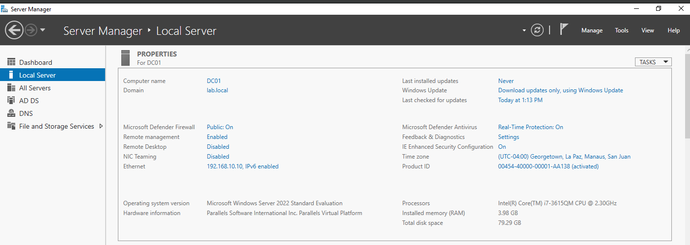

## 💡 Why This Matters

Every Windows enterprise relies on Domain Controllers to authenticate users, authorize access to network resources, and enforce organizational security policies. Building the server from the ground up demonstrates an understanding of enterprise infrastructure deployment rather than simply administering an existing environment.

---

# 🚀 Scenario 2 - Active Directory Domain Controller

## 📖 Objective

Install Active Directory Domain Services (AD DS) and promote the server into a Domain Controller.

## 🔧 Actions Performed

1. Installed the AD DS server role.
2. Promoted the server to a Domain Controller.
3. Created the **lab.local** domain.
4. Verified successful domain creation.
5. Confirmed Active Directory services were operational.

## 📷 Screenshot

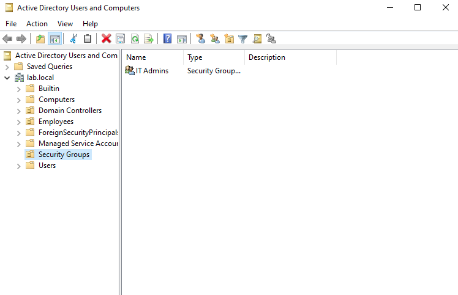

## 💡 Why This Matters

Active Directory centralizes authentication, authorization, identity management, and resource access. Understanding how to deploy and manage Domain Controllers is a core skill for Windows administrators and cybersecurity professionals responsible for securing enterprise environments.

---

# 🚀 Scenario 3 - DNS Configuration

## 📖 Objective

Configure Active Directory Integrated DNS to support authentication and service discovery.

## 🔧 Actions Performed

1. Installed the DNS Server role.
2. Verified Forward Lookup Zones.
3. Confirmed Active Directory integration.
4. Validated DNS records.
5. Ensured domain services were discoverable.

## 📷 Screenshot

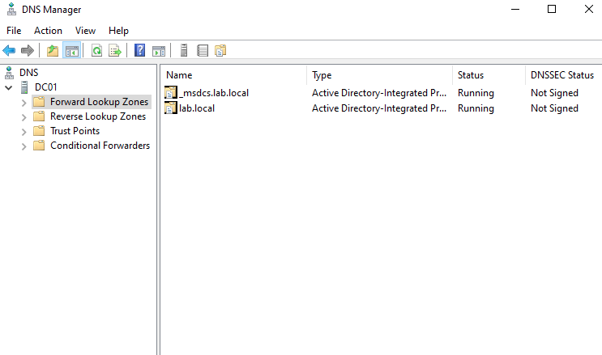

## 💡 Why This Matters

DNS is one of the most critical services within Active Directory. Kerberos authentication, LDAP queries, Group Policy processing, and domain discovery all depend on accurate DNS records. Understanding this relationship is essential for troubleshooting enterprise Windows environments.

---

# 🚀 Scenario 4 - User & Group Administration

## 📖 Objective

Create organizational units, user accounts, and security groups to simulate a realistic enterprise directory.

## 🔧 Actions Performed

1. Created Organizational Units.
2. Created multiple domain users.
3. Created security groups.
4. Assigned users to groups.
5. Verified directory organization.

## 📷 Screenshot

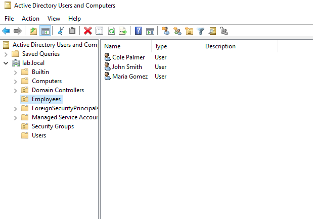

## 💡 Why This Matters

Proper directory organization simplifies administration, improves scalability, and supports the Principle of Least Privilege by assigning permissions through security groups rather than individual user accounts.

---
# 🚀 Scenario 5 - Kali Linux Installation

## 📖 Objective

Deploy and configure a Kali Linux virtual machine to serve as the dedicated security workstation for reconnaissance, enumeration, and Active Directory security assessments.

## 🔧 Actions Performed

1. Installed Kali Linux 2026.2 in Parallels Desktop.
2. Updated system packages and repositories.
3. Configured Shared (NAT) and Host-Only network adapters.
4. Installed reconnaissance utilities including **Nmap**, **SMBMap**, **smbclient**, and **ldapsearch**.
5. Verified network interfaces and IP addressing.

## 📷 Screenshot

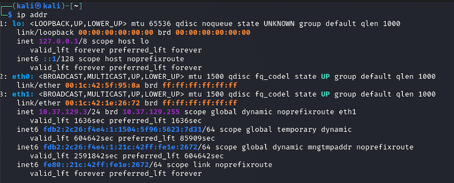

## 💡 Why This Matters

Kali Linux is one of the most widely used operating systems for penetration testing and defensive security validation. Configuring a dedicated security workstation mirrors how security analysts and penetration testers perform assessments in enterprise environments while keeping offensive tooling isolated from production systems.

---

# 🚀 Scenario 6 - Network Connectivity Validation

## 📖 Objective

Verify communication between the Kali Linux workstation and the Windows Server Domain Controller before beginning security enumeration.

## 🔧 Actions Performed

1. Confirmed Host-Only networking configuration.
2. Verified IP addressing.
3. Tested ICMP connectivity using `ping`.
4. Confirmed successful communication between both virtual machines.
5. Resolved networking issues encountered during initial configuration.

## 📷 Screenshot

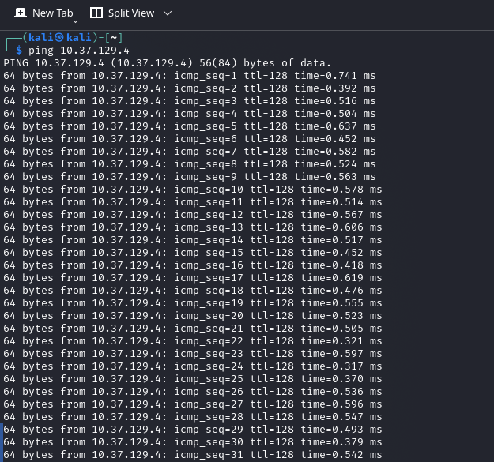

## 💡 Why This Matters

Before any security assessment can begin, connectivity must first be validated. Verifying communication between systems eliminates network misconfiguration as a potential source of later issues and reflects standard troubleshooting practices used by IT and cybersecurity professionals.

---

# 🚀 Scenario 7 - Network Service Enumeration

## 📖 Objective

Identify network services exposed by the Domain Controller using Nmap to better understand the attack surface of the Active Directory environment.

## 🔧 Actions Performed

1. Performed targeted TCP port scanning using Nmap.
2. Identified Active Directory-related services.
3. Verified service availability.
4. Confirmed successful communication with the Domain Controller.
5. Documented exposed services for further enumeration.

## 📷 Screenshot

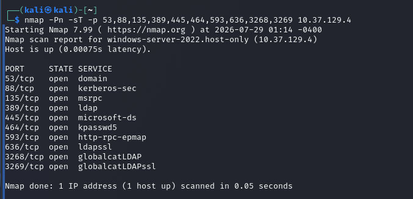

## 🔍 Services Discovered

| Port | Service | Purpose |
|------|---------|---------|
| 53 | DNS | Domain Name Resolution |
| 88 | Kerberos | Authentication |
| 135 | RPC | Remote Procedure Calls |
| 389 | LDAP | Directory Services |
| 445 | SMB | File Sharing |
| 464 | Kerberos Password | Password Changes |
| 593 | RPC over HTTP | Remote Management |
| 636 | LDAPS | Secure LDAP |
| 3268 | Global Catalog | Forest-wide Directory Searches |
| 3269 | Global Catalog SSL | Secure Global Catalog |

## 💡 Why This Matters

Network enumeration is one of the first phases of any security assessment. Identifying exposed services provides visibility into the infrastructure, confirms Active Directory functionality, and establishes the foundation for subsequent authentication and directory enumeration.

---

# 🚀 Scenario 8 - SMB Share Enumeration

## 📖 Objective

Enumerate available SMB shares using authenticated credentials to identify accessible network resources.

## 🔧 Actions Performed

1. Authenticated to SMB using domain credentials.
2. Enumerated available shares.
3. Reviewed permissions.
4. Verified access to administrative shares.
5. Documented available network resources.

## 📷 Screenshot

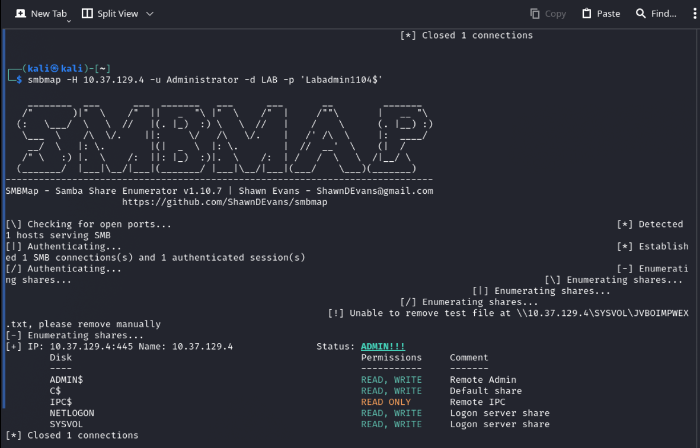

## 🔍 Shares Enumerated

- ADMIN$
- C$
- IPC$
- NETLOGON
- SYSVOL

## 💡 Why This Matters

SMB enumeration demonstrates how authenticated users can discover shared resources throughout a Windows environment. Understanding SMB permissions is essential for both systems administration and cybersecurity because improperly configured shares can expose sensitive information or facilitate lateral movement.

---

# 🚀 Scenario 9 - LDAP RootDSE Enumeration

## 📖 Objective

Perform LDAP RootDSE enumeration to retrieve metadata describing the Active Directory environment.

## 🔧 Actions Performed

1. Queried the RootDSE object.
2. Retrieved naming contexts.
3. Identified supported LDAP capabilities.
4. Verified forest and domain functionality.
5. Documented Active Directory metadata.

## 📷 Screenshot

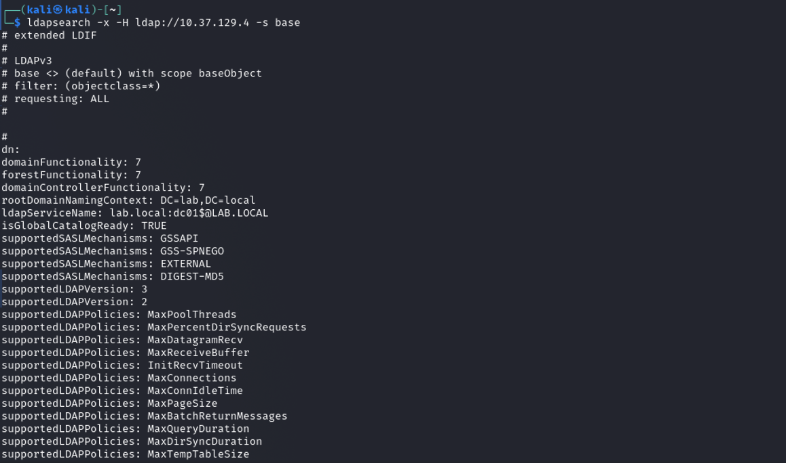

## 💡 Why This Matters

RootDSE contains valuable information describing the capabilities and configuration of an Active Directory environment. Even without privileged access, administrators and security professionals can leverage this information for troubleshooting, inventory, and security assessments.

---

# 🚀 Scenario 10 - Authenticated LDAP Enumeration

## 📖 Objective

Use authenticated LDAP queries to enumerate Active Directory objects using valid domain credentials.

## 🔧 Actions Performed

1. Authenticated using the Administrator account.
2. Connected to the LDAP service.
3. Queried directory objects.
4. Verified successful authentication.
5. Retrieved Active Directory object information.

## 📷 Screenshot

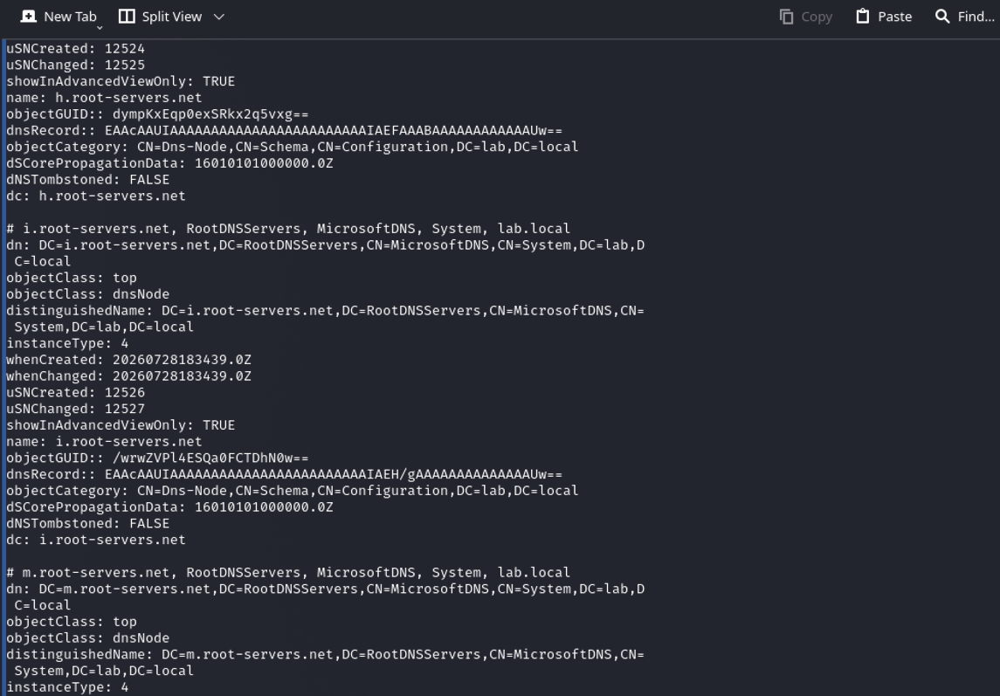

## 💡 Why This Matters

LDAP is the primary protocol used to interact with Active Directory. Understanding how authenticated users query directory services is valuable for administrators managing enterprise environments and security professionals evaluating directory exposure.

---

# 🚀 Scenario 11 - LDAP User Enumeration

## 📖 Objective

Enumerate user objects stored within Active Directory using LDAP queries.

## 🔧 Actions Performed

1. Queried user objects from Active Directory.
2. Retrieved Distinguished Names (DNs).
3. Reviewed object attributes.
4. Examined security group membership.
5. Verified successful user enumeration.

## 📷 Screenshot

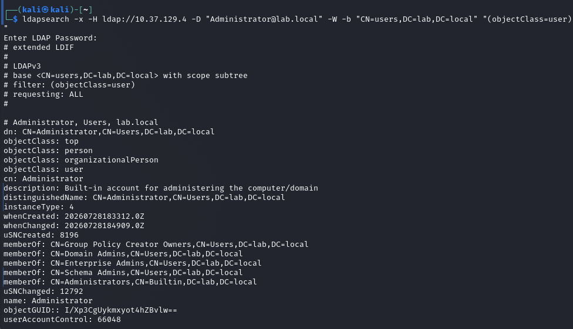

## 💡 Why This Matters

User enumeration demonstrates how directory information can be retrieved after successful authentication. Understanding what information is exposed—and to whom—is fundamental for identity management, access control, and Active Directory security monitoring.

---# 🛠️ Technologies Used

| Category | Technologies |
|-----------|--------------|
| Operating Systems | Windows Server 2022, Kali Linux 2026.2 |
| Virtualization | Parallels Desktop |
| Directory Services | Active Directory Domain Services (AD DS) |
| Networking | TCP/IP, DNS, ICMP, Host-Only Networking, NAT |
| Authentication | Kerberos, LDAP |
| File Sharing | SMB |
| Enumeration Tools | Nmap, SMBMap, smbclient, ldapsearch |
| Administration | Server Manager, Active Directory Users & Computers, DNS Manager |
| Command Line | Windows PowerShell, Linux Bash |

---

# 🧠 Skills Demonstrated

| Skill | Description |
|-------|-------------|
| Windows Server Administration | Installed, configured, and managed Windows Server 2022. |
| Active Directory | Deployed AD DS, promoted a Domain Controller, and managed users, groups, and Organizational Units. |
| DNS Administration | Configured and validated Active Directory Integrated DNS. |
| Network Configuration | Configured NAT and Host-Only virtual networking to enable secure communication between virtual machines. |
| Linux Administration | Installed and configured Kali Linux while managing networking and security tools. |
| Network Troubleshooting | Diagnosed and resolved connectivity, DNS, authentication, and routing issues. |
| Nmap Enumeration | Identified Active Directory services through targeted TCP scanning. |
| SMB Enumeration | Enumerated administrative shares using authenticated SMB sessions. |
| LDAP Enumeration | Queried Active Directory metadata and user objects using LDAP. |
| Authentication Protocols | Worked with Kerberos, LDAP, DNS, and SMB within a Windows domain environment. |
| Documentation | Produced technical documentation suitable for portfolio presentation and knowledge sharing. |

---

# 🎯 MITRE ATT&CK Mapping

The reconnaissance and enumeration activities performed throughout this lab align with several techniques documented within the MITRE ATT&CK framework.

| ATT&CK Technique | Description |
|-----------------|-------------|
| T1018 | Remote System Discovery |
| T1046 | Network Service Discovery |
| T1087 | Account Discovery |
| T1069 | Permission Group Discovery |
| T1482 | Domain Trust Discovery (Foundational AD Enumeration) |
| T1082 | System Information Discovery |

> **Note:** This project focused exclusively on defensive learning and infrastructure validation. No exploitation, privilege escalation, persistence, credential theft, or malicious post-exploitation activities were performed.

---

# 📚 Lessons Learned

## Understanding the Relationship Between Active Directory and DNS

One of the biggest takeaways from this project was recognizing how tightly Active Directory depends on DNS. Before completing this lab, DNS primarily seemed like a service used for translating hostnames into IP addresses. Through deployment and troubleshooting, it became clear that Active Directory relies on DNS for nearly every authentication and directory operation. Kerberos authentication, LDAP queries, Group Policy processing, and service discovery all depend on accurate DNS records. Experiencing this firsthand reinforced why DNS is often one of the first areas administrators investigate when domain-related issues occur.

---

## The Importance of Troubleshooting Over Memorization

Building the lab involved more than following installation steps. Several networking, authentication, and configuration issues had to be identified and resolved before the environment functioned correctly. Troubleshooting these problems required reviewing IP addressing, virtual networking, DNS configuration, service availability, and authentication behavior rather than relying solely on documentation. This experience reinforced that successful IT and cybersecurity professionals are distinguished not only by technical knowledge, but also by their ability to methodically diagnose and resolve complex infrastructure issues.

---

## Reconnaissance as the Foundation of Security Assessments

Security assessments begin with understanding the environment rather than attempting exploitation. Using tools such as Nmap, SMBMap, smbclient, and ldapsearch demonstrated how much information can be gathered from legitimate services using authorized access. Enumerating open ports, shared resources, and directory objects provided valuable insight into how enterprise networks expose services and organize identity information. This project strengthened my understanding of the reconnaissance phase and highlighted the importance of visibility, proper access controls, and secure configuration within Windows environments.

---

# 🚀 Future Enhancements

This home lab provides a solid foundation for expanding into more advanced enterprise and cybersecurity concepts. Planned improvements include:

- Add Windows 11 client machines and join them to the domain.
- Deploy and manage Group Policy Objects (GPOs).
- Configure Active Directory Certificate Services (AD CS).
- Implement Windows Event Forwarding (WEF).
- Deploy Microsoft Defender for Endpoint.
- Build a centralized logging solution using Microsoft Sentinel or Splunk.
- Expand the environment to include multiple Organizational Units and delegated administration.
- Simulate user lifecycle management, including onboarding and offboarding.
- Practice PowerShell automation for Active Directory administration.
- Integrate cloud identity concepts using Microsoft Entra ID (Azure AD).

---# 📚 References

The following resources were used throughout the planning, deployment, troubleshooting, and documentation of this home lab.

## Microsoft Documentation

- Microsoft Learn — Windows Server Documentation  
  https://learn.microsoft.com/windows-server/

- Microsoft Learn — Active Directory Domain Services Overview  
  https://learn.microsoft.com/windows-server/identity/ad-ds/get-started/virtual-dc/active-directory-domain-services-overview

- Microsoft Learn — DNS Overview  
  https://learn.microsoft.com/windows-server/networking/dns/dns-top

---

## Kali Linux Documentation

- Kali Linux Official Documentation  
  https://www.kali.org/docs/

- Kali Linux Tools Documentation  
  https://www.kali.org/tools/

---

## Security Tools

### Nmap

- https://nmap.org/

### SMBMap

- https://github.com/ShawnDEvans/smbmap

### smbclient

- https://www.samba.org/

### OpenLDAP Utilities

- https://www.openldap.org/

---

## Cybersecurity Frameworks

### MITRE ATT&CK Framework

https://attack.mitre.org/

### NIST Cybersecurity Framework

https://www.nist.gov/cyberframework

---

# ⚠️ Educational Disclaimer

This project was created exclusively for educational purposes within a privately owned virtual lab environment.

All systems were built, configured, and tested inside an isolated network under my control. The reconnaissance and enumeration techniques demonstrated throughout this project were performed only against systems that I personally configured and owned.

No unauthorized testing, exploitation, persistence, credential attacks, or malicious activities were performed. The objective of this project was to strengthen my understanding of Windows infrastructure, Active Directory, networking, and defensive cybersecurity concepts through hands-on learning.

---

# 👨‍💻 About Me

Hi, I'm **Virch Reid**, an IT Support professional transitioning into Cybersecurity with a passion for Windows infrastructure, cloud technologies, and enterprise security.

I enjoy building home labs that allow me to better understand how enterprise environments are deployed, administered, secured, and troubleshot. My goal is to continue expanding my technical skills through hands-on projects while pursuing opportunities in IT Support, Systems Administration, Cloud, and Cybersecurity.

### Current Areas of Focus

- Windows Server Administration
- Active Directory
- Microsoft Entra ID (Azure AD)
- Microsoft Azure
- AWS Cloud Fundamentals
- Networking
- Linux Administration
- PowerShell
- Security Operations (SOC)
- Identity & Access Management

---

# 📂 Repository Structure

```
Active-Directory-Cybersecurity-Home-Lab/
│
├── README.md
│
├── images/
│   ├── #1 Windows Server Base Build.png
│   ├── #2 Active Directory Domain Controller.png
│   ├── #3 DNS.png
│   ├── #4 User & Group Administration.png
│   ├── #5 Kali Linux Installation.png
│   ├── #6 Connectivity Between Kali and Domain Controller.png
│   ├── #7 Network Service Enumeration.png
│   ├── #8 SMB Share Enumeration with SMBMap.png
│   ├── #9 LDAP RootDSE Enumeration.png
│   ├── #10 Authenticated LDAP Enumeration.png
│   └── #11 LDAP User Enumeration.png
│
└── LICENSE
```

---

# 🏆 Key Takeaways

Throughout this project, I successfully:

- Built an enterprise-style Windows Active Directory environment from scratch.
- Configured Active Directory Domain Services and Microsoft DNS.
- Created and managed users, groups, and Organizational Units.
- Configured virtual networking between multiple operating systems.
- Deployed and configured Kali Linux as a dedicated security workstation.
- Validated network communication through troubleshooting and testing.
- Performed network reconnaissance using Nmap.
- Enumerated SMB shares and permissions.
- Queried Active Directory using LDAP.
- Strengthened my understanding of Windows authentication, directory services, DNS, and enterprise networking.
- Produced professional technical documentation suitable for a cybersecurity portfolio.

---

# 🚀 Next Steps

This project established a strong foundation in Windows infrastructure and Active Directory. Future lab enhancements will focus on expanding the environment to simulate a larger enterprise network and explore additional defensive security technologies.

Planned improvements include:

- Domain-joined Windows 11 workstation
- Group Policy Object (GPO) administration
- Microsoft Entra ID integration
- Windows Event Forwarding (WEF)
- Microsoft Defender for Endpoint
- SIEM integration with Microsoft Sentinel or Splunk
- PowerShell automation
- Active Directory Certificate Services (AD CS)
- Multi-Domain Controller environment
- Security monitoring and log analysis

---

# ⭐ Thank You for Visiting

Thank you for taking the time to review this project.

This home lab represents an important step in my transition into cybersecurity by combining enterprise Windows administration, networking, troubleshooting, and security enumeration into a single hands-on project.

If you have feedback or suggestions for improving the lab or documentation, I welcome the opportunity to continue learning and improving.

---

**⭐ If you found this project interesting or helpful, consider giving the repository a star!**
